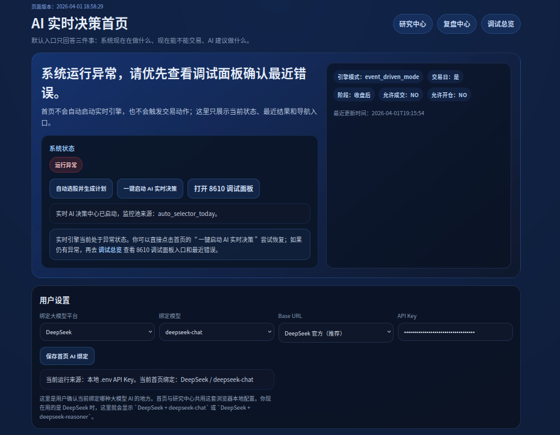
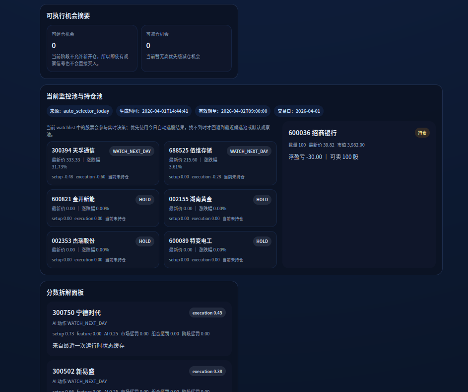
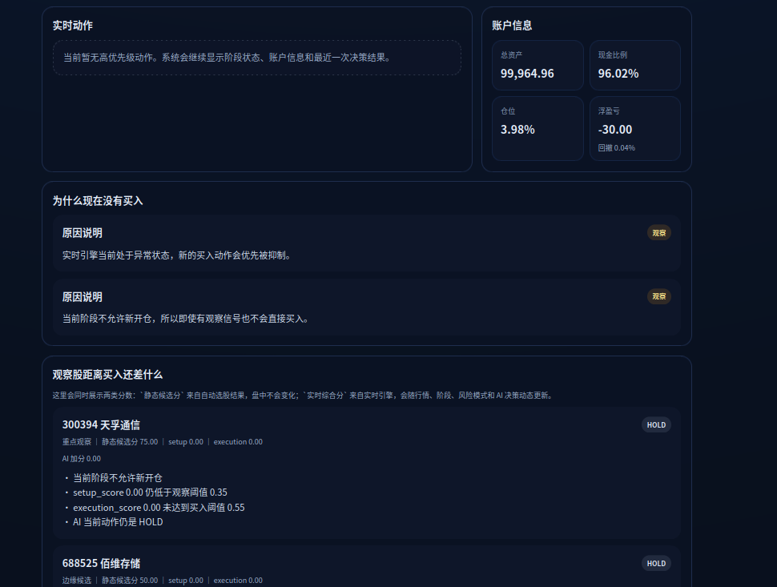
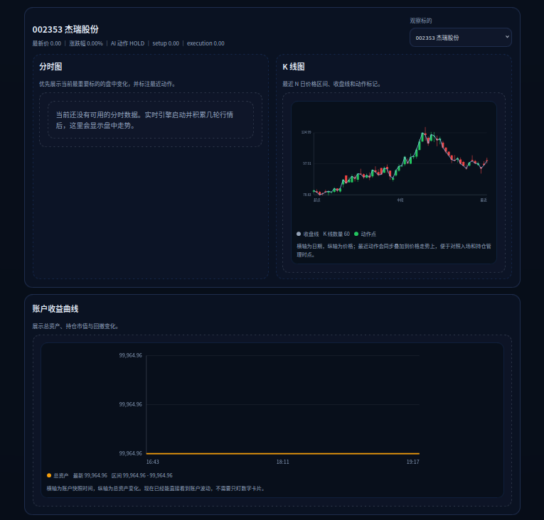
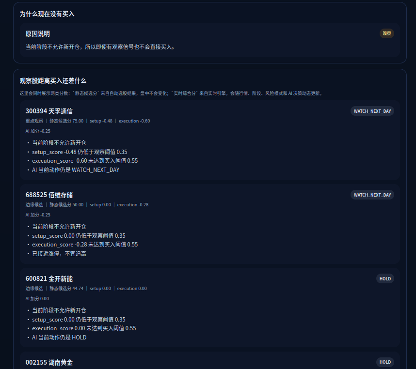
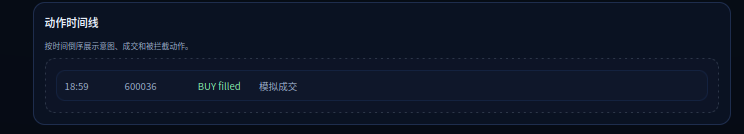

# TradeforAgents-minimal

面向中国 A 股的 AI 交易分析与模拟系统。

这个仓库现在的默认产品入口是：

- `8600`：AI 实时交易前台
- `8610`：高级调试后台

系统支持：

- 自动选股与候选池生成
- 盘中动态 watchlist 演化
- AI 决策、风控、模拟成交
- 账户、图表、动作时间线展示
- 策略评估、自适应权重、风格识别

系统不支持：

- 券商真实下单
- 高频 / 秒级交易
- 券商账户自动同步

## 部署与启动

### 本地快速开始

要求：

- `Python 3.10+`
- Linux/macOS shell 环境
- 可用的 `DeepSeek API Key`

当前网页端模型接入只支持：

- `DeepSeek`

第一次使用建议先准备 `.env`：

```bash
cd /home/alientek/workspace/tools/TradeforAgents-minimal
cp .env.example .env
```

至少填写：

```bash
DEEPSEEK_API_KEY=sk-xxxx
DEEPSEEK_BASE_URL=https://api.deepseek.com
```

启动产品前台：

```bash
cd /home/alientek/workspace/tools/TradeforAgents-minimal
bash start.sh web
```

打开：

- `http://127.0.0.1:8600/`

### Windows 用户

如果你使用 Windows 分发包，优先使用这两条路径：

- 安装版：
  - 下载 `tradeforagents-windows-installer-vX.Y.Z.exe`
  - 双击安装
  - 从桌面或开始菜单启动
- 绿色版：
  - 下载 `tradeforagents-windows-noinstall-vX.Y.Z.zip`
  - 解压
  - 双击 `start.bat`

Windows 分发包默认目标：

- 不需要单独安装 Python
- 双击即可启动 `8600`
- 可选同时启动实时引擎与 `8610`
- 日志保留在 `ai_stock_sim/data/logs/`

发布与分发建议：

- 对外至少同时提供：
  - 安装版：`tradeforagents-windows-installer-vX.Y.Z.exe`
  - 免安装版：`tradeforagents-windows-noinstall-vX.Y.Z.zip`
- 不建议只发布 installer
- `start.bat` 与 `debug_console.bat` 应保留在包内，便于测试和排错
- `.bat` 不需要单独作为 Release 附件上传

首页点击：

- `一键启动 AI 实时决策（会自动补监控池）`

这一步会自动尝试完成：

```text
检查当前 watchlist
-> 若缺失 / 过期 / 仅有默认观察池，则先自动选股
-> 同步 runtime watchlist
-> 启动实时引擎
-> 启动 8610 调试面板
```

高级调试后台默认地址：

- `http://127.0.0.1:8610/`

### 直接启动引擎和调试台

如果你想跳过 8600，直接拉起引擎：

```bash
cd /home/alientek/workspace/tools/TradeforAgents-minimal/ai_stock_sim
bash scripts/bootstrap.sh
bash scripts/run_engine.sh
bash scripts/run_dashboard.sh
```

### 云端部署

云服务器部署说明见：

- [云端部署说明](/home/alientek/workspace/tools/TradeforAgents-minimal/docs/minimal_cloud_deploy.md)

## 如何使用

### 最推荐的日常使用方式

1. 打开 `8600`
2. 在首页确认 `DeepSeek` 绑定配置
3. 点击 `一键启动 AI 实时决策（会自动补监控池）`
4. 直接看首页的：
   - AI 结论主卡
   - 当前交易状态
   - 当前最重要股票
   - 监控池 / 持仓池
   - 图表、收益曲线、动作时间线
5. 需要看底层原因时，再打开 `8610`

### 8600 和 8610 的分工

- `8600`：给日常使用者 / 客户看
  - 系统现在在干嘛
  - 能不能交易
  - AI 建议做什么
  - 当前最重要的股票是谁
- `8610`：给开发者 / 调试者看
  - 决策上下文
  - 风控结果
  - 策略评估
  - 决策归因
  - 权重变化与风格切换

### 研究中心和复盘中心

虽然首页已经是默认入口，但原有能力仍保留：

- `研究中心`
  - 自动选股
  - 单股分析
  - 候选卡片
  - 分享页
- `复盘中心`
  - 交易计划
  - 模拟盘结果
  - 复盘摘要

AI 交易工作流说明见：

- [AI 交易工作流](/home/alientek/workspace/tools/TradeforAgents-minimal/docs/ai_trade_workflow.md)

## 当前产品结构

### 8600：AI 实时交易前台

首页重点展示：

- AI 结论主卡
- 当前交易状态与执行权限
- 账户信息
- 当前最重要股票
- 当前监控池 / 持仓池
- 分时图 / K 线图 / 收益曲线
- 动作时间线
- 可执行机会摘要

### 8610：高级调试后台

调试台重点展示：

- 当前模式与市场总览
- 交易日历 / 当前阶段 / 执行权限
- 策略表现分析
- 决策归因分析
- 权重变化历史
- 市场状态与交易风格
- 错误交易分析

## 界面预览

### 8600 首页总览



### 交易状态、策略摘要与执行统计



### 监控池、持仓池与图表区





### 账户与动作时间线





## 关键能力

- A 股交易日历与交易阶段驱动
- 事件驱动实时决策
- `setup_score + execution_score` 双分体系
- 盘中动态扫描新机会
- watchlist 自进化
- A 股规则风控与模拟成交
- 策略评估与学习层
- AI 风格自适应

引擎细节见：

- [ai_stock_sim/README.md](/home/alientek/workspace/tools/TradeforAgents-minimal/ai_stock_sim/README.md)

## 常见问题

### 页面没填 API Key，为什么首页还有 AI？

如果首页没有显式填写，系统可能会回退到：

- 本地 `.env`
- 本地已有研究结果 / `decision.json`

如果你希望当前浏览器会话明确使用自己的配置，请在首页设置区手动保存。

### Windows 双击启动后没反应怎么办？

优先检查：

- 重新运行 `debug_console.bat`
- 查看 `ai_stock_sim/data/logs/`
- 确认 `8600` 是否已被其它进程占用
- 确认 `.env` 或首页设置里已经填写 `DEEPSEEK_API_KEY`

### 一键启动是不是还需要先手动选股？

正常不需要。

首页的一键启动会优先检查监控池：

- 有有效池：直接启动
- 没有 / 过期 / 只有默认观察池：先自动选股，再启动

### 为什么现在不能成交？

常见原因：

- 非交易时段
- 午休
- 风控限制
- 当前风险模式偏防守
- `execution_score` 没过执行阈值

## 当前限制

- 不是实盘交易系统
- 首页已经产品化，但仍存在部分运行时同步和稳定性边角问题
- 学习层仍在持续完善中
- 当前网页模型接入只支持 `DeepSeek`

## 更多文档

- [AI 交易工作流](/home/alientek/workspace/tools/TradeforAgents-minimal/docs/ai_trade_workflow.md)
- [云端部署说明](/home/alientek/workspace/tools/TradeforAgents-minimal/docs/minimal_cloud_deploy.md)
- [实时引擎说明](/home/alientek/workspace/tools/TradeforAgents-minimal/ai_stock_sim/README.md)
- [Release Notes 索引](/home/alientek/workspace/tools/TradeforAgents-minimal/docs/releases/README.md)
- Windows 打包脚本目录： [packaging/windows](/home/alientek/workspace/tools/TradeforAgents-minimal/packaging/windows)

## 更新记录 / Releases

详细更新记录不再堆在 README 里，请查看：

- GitHub Releases: https://github.com/TATDistance/TradeforAgents-minimal/releases
- 仓库内 Release Notes 索引： [docs/releases/README.md](/home/alientek/workspace/tools/TradeforAgents-minimal/docs/releases/README.md)
